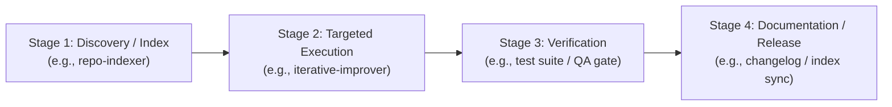
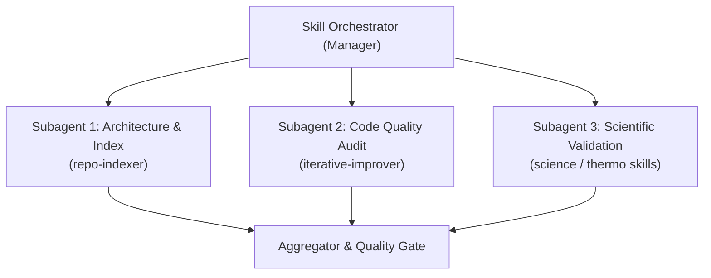

# Dynamic Skill Orchestrator

The **Dynamic Skill Orchestrator** is an executive workflow coordinator designed to dynamically plan, route, execute, and verify complex multi-phase software development tasks by chaining and orchestrating specialized agent skills and subagents.

---

## 1. Core Principles

1. **Dynamic Composition**: Do not hardcode rigid pipelines. Inspect the incoming task, discover available skills across the workspace (`.agents/skills/`), global configuration, and plugins, and dynamically synthesize the optimal workflow graph.
2. **Single Responsibility**: Delegate domain-specific tasks to dedicated skills (e.g., repository mapping to `repo-indexer`, step-by-step fixes to `iterative-improver`, frontend to `modern-web-guidance`, literature to `pubmed-database`).
3. **State & Artifact Passing**: Pass structured artifacts and metrics between stages (e.g., index findings $\rightarrow$ hotspot targeting $\rightarrow$ code refactoring $\rightarrow$ test verification $\rightarrow$ documentation).
4. **Execution Safety & Quality Gates**: Require explicit approval or test verification before advancing past critical milestones.

---

## 2. Dynamic Execution Modes

The orchestrator dynamically chooses or combines three execution patterns depending on the task topology:

### Pattern A: Sequential Pipeline (Linear Dependency)
Use when each stage strictly depends on the output of the preceding stage.


### Pattern B: Parallel Swarm (Concurrent Subagents)
Use when independent domains can be analyzed or executed concurrently without shared file conflicts.


### Pattern C: Conditional / Adaptive Branching
Use when subsequent actions depend on intermediate discovery or verification results.
- **Branch If Clean**: Proceed to next feature or release tagging.
- **Branch If Fault / Hotspot Found**: Route to diagnostic analysis, request user permission, and apply targeted fixes.

---

## 3. Standard Orchestration Lifecycle

Each orchestration run follows these 5 phases:

```text
[1. Discover & Map] ──> [2. Formulate Plan] ──> [3. Execute Stages] ──> [4. Verify Gates] ──> [5. Publish State]
```

### Phase 1: Skill Discovery & Intent Resolution
1. Scan `.agents/skills/` and system-available skills.
2. Match user request against skill capabilities and metadata.
3. Determine dependency graph (which outputs feed which inputs).

### Phase 2: Dynamic Plan Formulation
Create an explicit, trackable execution table:
- **Pipeline ID**: e.g., `ORCH-2026-10-03`
- **Goal Statement**: Concrete objective.
- **Stages**:
  - `STAGE-1`: Skill Name, Target Domain, Input Artifact, Output Contract.
  - `STAGE-2`: Skill Name, Target Domain, Input Artifact, Output Contract.
- **Quality Gate**: Passing criteria (e.g., all unit tests green, zero lint errors).

### Phase 3: Stage-by-Stage Execution
- **When invoking a skill**: Load its `SKILL.md` rules and execute its operational procedures faithfully.
- **When delegating to subagents**: Use `invoke_subagent` with clear, role-specific prompts and wait for asynchronous completion notifications.
- **Context Hygiene**: Keep stage transcripts lean; save intermediate data to artifacts rather than cluttering conversation memory.

### Phase 4: Quality Gate & Checkpoint Verification
- Run regression tests (`pytest`, linting, or validation scripts).
- If a stage requires user authorization (such as modifying critical code or bumping versions), trigger an interactive checkpoint and request permission.

### Phase 5: State Reconciliation & Summary
- Update tracking files (`TODO_*.md`, `PROJECT_INDEX.md`, or release notes).
- Present a concise executive summary to the user outlining what each skill accomplished and the resulting status.

---

## 4. Built-in Dynamic Templates

### Template 1: `Audit & Continuous Improvement`
- **Stage 1**: `repo-indexer` $\rightarrow$ Map recent churn, identify hotspots and architecture layers.
- **Stage 2**: `iterative-improver` $\rightarrow$ Select single highest-priority issue, formulate proposal, ask permission.
- **Stage 3**: Code Implementation $\rightarrow$ Apply safe, localized patch.
- **Stage 4**: Test Suite $\rightarrow$ Run `pytest -q`, verify zero regressions.
- **Stage 5**: `repo-indexer` $\rightarrow$ Update index freshness score.

### Template 2: `Scientific Verification & Modeling`
- **Stage 1**: `properties` & backend verification $\rightarrow$ Cross-check CoolProp, Thermo, NeqSim outputs.
- **Stage 2**: `aerodynamics` compliance $\rightarrow$ Validate ASME PTC 10 & API 617 equations.
- **Stage 3**: Reporting $\rightarrow$ Generate comparison diagrams and Markdown artifacts.

### Template 3: `Release Delivery Pipeline`
- **Stage 1**: Code quality and dead code purge.
- **Stage 2**: Automated regression suite.
- **Stage 3**: Version bump (`release_metadata.py`, spec files).
- **Stage 4**: DMG/Binary build and changelog generation.

---

## 5. Execution Rules & Constraints
- **Preserve Single-Source of Truth**: When passing parameters between skills, do not duplicate or redefine constants.
- **No Silent Failures**: If a skill step fails its acceptance criteria, halt the pipeline, document the root cause, and ask the user how to proceed.
- **Token Efficiency**: Use artifact files (`.md` / `.json`) for inter-stage state transfer so that subsequent skills consume minimal tokens.
